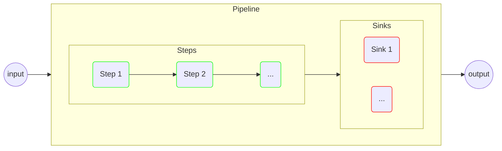
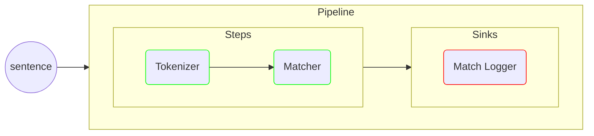

# data-pipeline

[](https://github.com/illuin/data-pipeline/actions/workflows/maven-build.yml)
[](https://central.sonatype.com/artifact/tech.illuin/data-pipeline)
[](https://javadoc.io/doc/tech.illuin/data-pipeline)
[](https://codecov.io/gh/illuin-tech/data-pipeline)


This library is a toolkit for describing data transformation pipelines by compositing simple reusable components.

A typical `data-pipeline` use-case can be:
* a system aggregating results from several external services: pipelines are modular, easily rearranged and each individual step can be padded with safety nets and error handling without affecting business logic
* a system performing iterative analysis on an input: the `data-pipeline` data model retains intermediate results from all steps, and each result is tagged with lineage metadata

On top of its core feature-set, complying to the `data-pipeline` model comes with rather nice benefits:
* out-of-the-box support for [micrometer](https://micrometer.io) based metrics (success/failure rates, error tracking, etc.)
* out-of-the-box support for [slf4j](https://www.slf4j.org) log markers (pipeline id, component id, etc.)
* easily pluggable [resilience4j](https://resilience4j.readme.io) based resilience features (retries, time-limiter, etc.)

## I. Installation

The library requires Java 17+, in order to use it, add the following in your `pom.xml`:

```xml
<dependency>
    <groupId>tech.illuin</groupId>
    <artifactId>data-pipeline</artifactId>
    <version>0.19</version>
</dependency>
```

Additionally, some optional extension libraries can be added, at the time of this writing this includes:
* `data-pipeline-resilience4j` (for the [`resilience4j` integration](doc/integrations.md#resilience4j))

## II. Core Principles

The main goals behind its design were:
1. having a fairly straightforward API and overall design: pipelines are made from compositing user-defined functions executed in a linear fashion
2. leveraging this design to introduce useful features: data-model with lineage features, parallel execution, resilience features (retry, time-limiter, etc.), systematic performance metrics, error tracking, etc.

A simplified high-level view of a `data-pipeline` pipeline looks like the following diagram:
* the main phase is composed of `Step` functions, they return a `Result` and are expected to have no side effect (think of them as almost-pure functions)
* the end phase is composed of `Sink` functions, they return `void` and are expected to induce side effects (e.g. database persistence, message queue push, etc.)



## III. Basic Usage

We'll go through a quick example in order to demonstrate what `data-pipeline` looks like in action.   

The goal of this example is to have a simple pipeline for:
* performing a basic tokenization of a sentence
* performing a basic analysis of said tokens
* recovering results and logging them out



### Defining steps and sinks

First, we'll design the `Tokenizer` step, with a basic regex split.

Three things to note here, which will remain true for the following pieces:
* The step's entrypoint is annotated with `@StepConfig`, it will be identified at the pipeline build time
* Some component inputs have to be annotated in order to narrow down their identity, the pipeline input can be supplied with the `@Input` annotation
* The step output are expected to be a `Result` subtype, here we chose to go with a dedicated `record`

```java
public class Tokenizer
{
    @StepConfig(id = "tokenizer")
    public TokenizedSentence tokenize(@Input String sentence)
    {
        return new TokenizedSentence(Stream.of(sentence.split("[^\\p{L}]+"))
            .map(String::toLowerCase)
            .toList()
        );
    }

    public record TokenizedSentence(
        List<String> tokens
    ) implements Result {}
}
```

Next up, the `Matcher` step, with a blacklist specified upon instantiation.

It will recover the tokenizer's output, and produce a `Matches` record of its findings.

Note the `@Current` annotation for requesting the currently known value for tokenized sentence.
There is more to be said about the semantics of this annotation, which we'll cover in details in the [documentation](doc/result_data_model.md) section.

```java
public class Matcher
{
    private final Set<String> blacklist;
  
    public Matcher(String... blacklist)
    {
        this.blacklist = Set.of(blacklist);
    }
  
    @StepConfig(id = "matcher")
    public Matches match(@Current TokenizedSentence tokenized)
    {
        long wordCount = tokenized.tokens().stream().distinct().count();
        Set<String> matches = tokenized.tokens().stream()
            .filter(this.blacklist::contains)
            .collect(Collectors.toSet())
        ;
    
        return new Matches(wordCount, matches);
    }
    
    public record Matches(
        long wordCount,
        Set<String> blacklistMatches
    ) implements Result {}
}
```

Finally, our `MatchLogger` sink works very similarly, except we need the `@SinkConfig` annotation.

```java
public class MatchLogger
{
    private static final Logger logger = LoggerFactory.getLogger(MatchLogger.class);

    @SinkConfig(id = "logger")
    public void log(@Current TokenizedSentence tokenized, @Current Matches matches)
    {
        logger.info("Found {} unique tokens in {}, with {} blacklisted {}", matches.wordCount(), tokenized.tokens(), matches.blacklistMatches().size(), matches.blacklistMatches());
    }
}
```

### Setting-up the pipeline

Now that we have all our building blocks, creating a `Pipeline` is simply a matter of combining them.

The `Pipeline` interface offers a builder initialization method, we'll start from there.

```java
Pipeline<String> pipeline = Pipeline.<String>of("string-processor")
    .registerStep(new Tokenizer())
    .registerStep(new Matcher("mostly", "relatively"))
    .registerSink(new MatchLogger())
    .build()
;
```

Now, calling the pipeline with some sentences:

```java
pipeline.run("This is a relatively short and mostly meaningless sentence.");
pipeline.run("This is a much longer sentence that should go through the blacklist unscathed.");
pipeline.run("Relatively cool objects (temperatures less than several thousand degrees) emit their radiation primarily in the infrared, as described by Planck's law.");
pipeline.run("The principles were deliberately non dogmatic, since the brotherhood wished to emphasise the personal responsibility of individual artists to determine their own ideas and methods of depiction.");
pipeline.run("The Mystical Nativity, a relatively small and very personal painting, perhaps for his own use, appears to be dated to the end of 1500.");
```

We should get the following output (given a `simplelogger` or somesuch properly configured):

```
[main] INFO MatchLogger - Found 9 unique tokens in [this, is, a, relatively, short, and, mostly, meaningless, sentence], with 2 blacklisted [mostly, relatively]
[main] INFO MatchLogger - Found 13 unique tokens in [this, is, a, much, longer, sentence, that, should, go, through, the, blacklist, unscathed], with 0 blacklisted []
[main] INFO MatchLogger - Found 22 unique tokens in [relatively, cool, objects, temperatures, less, than, several, thousand, degrees, emit, their, radiation, primarily, in, the, infrared, as, described, by, planck, s, law], with 1 blacklisted [relatively]
[main] INFO MatchLogger - Found 23 unique tokens in [the, principles, were, deliberately, non, dogmatic, since, the, brotherhood, wished, to, emphasise, the, personal, responsibility, of, individual, artists, to, determine, their, own, ideas, and, methods, of, depiction], with 0 blacklisted []
[main] INFO MatchLogger - Found 21 unique tokens in [the, mystical, nativity, a, relatively, small, and, very, personal, painting, perhaps, for, his, own, use, appears, to, be, dated, to, the, end, of], with 1 blacklisted [relatively]
```

As pipelines may use resources (notably a `ServiceExecutor` for the —optional— async sink execution), it is best to close it down when you are done using it (or consider using a `try-with` pattern):

```java
pipeline.close();
```

## IV. Documentation

* [Pipelines](doc/pipelines.md)
  * [Configuration](doc/pipelines.md#configuration)
  * [Execution](doc/pipelines.md#execution)
  * [Shutting Down](doc/pipelines.md#shutting-down)
* [Result Data Model](doc/result_data_model.md)
* [Initializers](doc/initializers.md)
* [Steps](doc/steps.md)
* [Sinks](doc/sinks.md)
* [Function Modifiers & Hooks](doc/modifiers_and_hooks.md)
  * [Error Handlers](doc/modifiers_and_hooks.md#error-handlers)
  * [Wrappers](doc/modifiers_and_hooks.md#wrappers)
  * [UID Generators](doc/modifiers_and_hooks.md#uid-generators)
  * [Author Resolvers](doc/modifiers_and_hooks.md#author-resolvers)
  * [Tag Resolvers](doc/modifiers_and_hooks.md#tag-resolvers)
* [Integrations](doc/integrations.md)
  * [Micrometer](doc/integrations.md#micrometer)
  * [Prometheus](doc/integrations.md#prometheus)
  * [Grafana](doc/integrations.md#grafana)
  * [Logback Loki](doc/integrations.md#logback-loki)
  * [Resilience4j](doc/integrations.md#resilience4j)

## V. Dev Installation

This project will require you to have the following:

* Java 17+
* Git (versioning)
* Maven (dependency resolving, publishing and packaging) 
