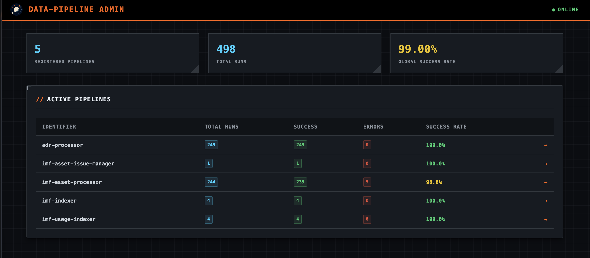
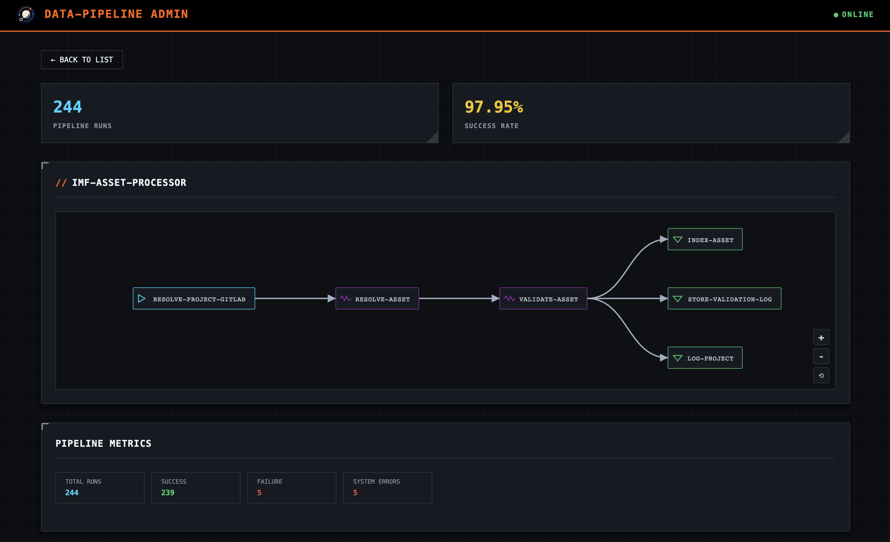
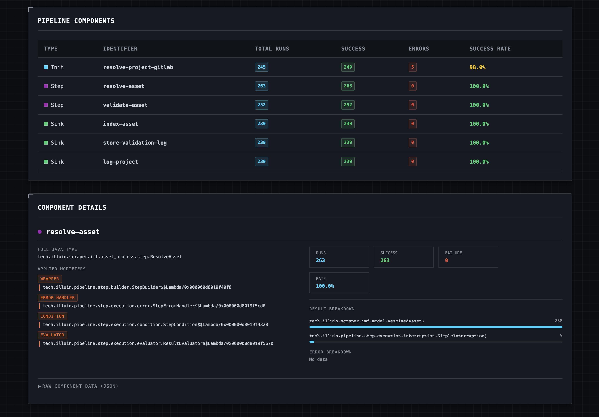

# Admin

`data-pipeline` provides an optional admin interface that allows you to monitor your pipelines and their performance.
It comes with a built-in web interface and a REST API.

## Integrations

The admin interface is available through several integrations, depending on your application stack:

* [Core Admin](/doc/admin_core.md): The base implementation using a built-in HTTP server, suited for simple/standalone applications.
* [Spring Boot Admin](/doc/admin_spring_boot.md): A seamless integration for Spring Boot applications.
* [Micronaut Admin](/doc/admin_micronaut.md): A seamless integration for Micronaut applications.
* [Quarkus Admin](/doc/admin_quarkus.md): A seamless integration for Quarkus applications.

## Interface

The admin interface provides a dashboard where you can see all registered pipelines, their configuration, and real-time performance metrics (if micrometer is enabled).

The home page of the admin interface is available (by default) at `/pipeline-admin`, this setting can be overridden in most integrations, refer to the following section for more details.

From there, each pipeline can be inspected in order to see its configuration and performance metrics:

