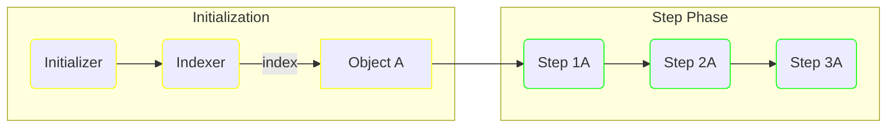
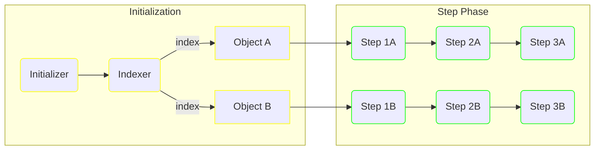
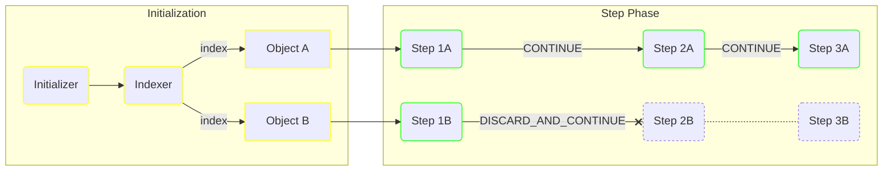

# Initializers

The `Initializer` is a component responsible for the initialization of a pipeline's "payload".

Payloads are used for two things:
* they are a piece of data inferred from the input, as such they can be used for patterns where your pipelines work on a domain entity which has to be resolved from external input 
* they are taken as input by the `Indexer` functions in order to determine the [object set](#indexers) which influences how `Step` functions are executed 

It is important to note that payloads are not always relevant to a pipeline, most of the time you won't need them and arguably if you can avoid them it will result in lower complexity.
By default, if you don't specify an `Initializer` (and thus, an `Indexer`) the `Pipeline` will use a placeholder payload and run all steps on it.
If that is your case, you can directly skip [to the next section](steps.md).

## Indexers

The `Indexer` functions are responsible for picking what objects the pipeline steps will be executed on.
Each `Step` will run once for each indexed "object", as a result, the `Indexer` can be considered as the place that determines the step execution flow.

In the example below, if the `Indexer A` indexes a single object, all defined steps will be executed on it once:



If the `Indexer A` returns a collection of objects, or if several `Indexer` functions index different objects, steps will be executed once on each of them:



Each `Step` sequence has its own control flow, so for instance [if you apply a `ResultEvaluator`](steps.md#result-evaluators) on a `Step` and trigger a `DISCARD_AND_CONTINUE` strategy, you can block a `Step` branch and follow-up on the others:



Currently, an `Indexer` can only return `Indexable` objects, i.e. with a declared `uid()` method.
The `Pipeline` will consider the indexable's `uid` and only index a given value once. 

If no `Indexer` is specified, the default indexing strategy is `SingleIndexer.auto()` which will attempt to index the payload as a whole (as a result, the payload is expected to be `Indexable`).

## Definition

An `Initializer` is a function that takes the pipeline input and context as arguments, and return the pipeline's payload.

For the sake of the following example, we'll consider a hypothetical scenario where we get a variety of inputs pertaining to vehicles that need to be analyzed
For each pipeline input we'll get a bunch of data that allow us to reconstruct our `Vehicle` entity.

```java
public record Vehicle(
    String uid, // we'll use the vehicle's own uid as the Indexable identifier
    Weight weight,
    Metadata metadata
) implements Indexable {}
```

A corresponding `Initializer` could look something like the following:

```java
public static class MyInitializer implements Initializer<MyInput, Vehicle>
{
    @Override
    public Vehicle initialize(MyInput input, Context<Vehicle> context, UIDGenerator generator)
    {
        return new Vehicle(
            //the constructor arguments are suggestive obviously
            input.getVehicleUid(),
            computeWeight(input),
            extractMetadata(context)
        );
    }
}
```

You will need at least one `Indexable` for the pipeline to run, by default the `Pipeline` will attempt to index the payload itself, which is possible here given we made the `Vehicle` an `Indexable`.
From there, you can register it the following way.

```java
Pipeline<MyInput, Vehicle> pipeline = Pipeline.of("my-pipeline", new MyInitializer())
    /* ...and others */
    .build()
;
```


## Configuration

## Possible Inputs
