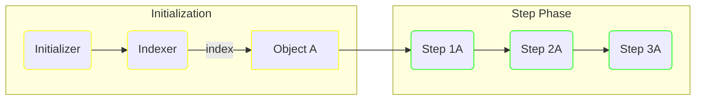
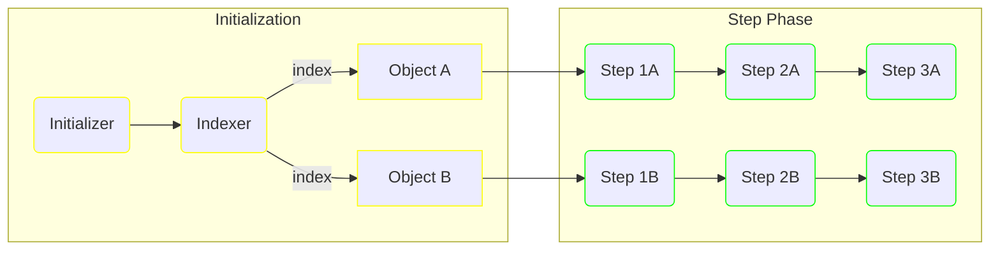
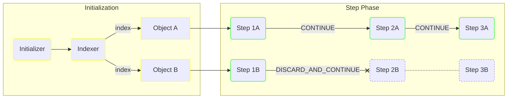
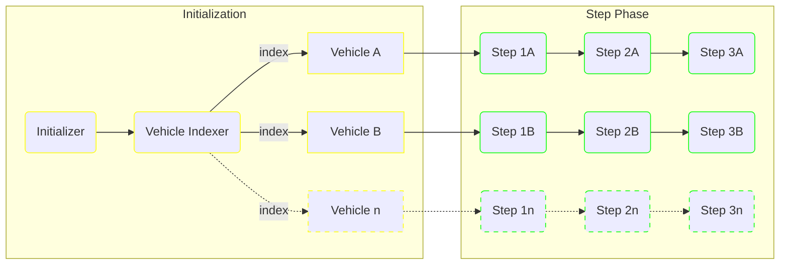

# Initializers

The `Initializer` is a component responsible for the initialization of a pipeline's "payload".

Payloads are used for two things:
* they are a piece of data inferred from the input, as such they can be used for patterns where your pipelines work on a domain entity which has to be resolved from external input 
* they are taken as input by the `Indexer` functions in order to determine the [object set](#indexers) which influences how `Step` functions are executed 

It is important to note that payloads are not always relevant to a pipeline, most of the time you won't need them and arguably if you can avoid them it will result in lower complexity.
By default, if you don't specify an `Initializer` (and thus, an `Indexer`) the `Pipeline` will use a placeholder payload and run all steps on it.
If that is your case, you can directly skip [to the next section](steps.md).

## Indexers

The `Indexer` functions are responsible for picking what objects the pipeline steps will be executed on.
Each `Step` will run once for each indexed "object", as a result, the `Indexer` can be considered as the place that determines the step execution flow.

In the example below, if the `Indexer A` indexes a single object, all defined steps will be executed on it once:



If the `Indexer A` returns a collection of objects, or if several `Indexer` functions index different objects, steps will be executed once on each of them:



Each `Step` sequence has its own control flow, so for instance [if you apply a `ResultEvaluator`](steps.md#result-evaluators) on a `Step` and trigger a `DISCARD_AND_CONTINUE` strategy, you can block a `Step` branch and follow-up on the others:



> 🚨 Currently, an `Indexer` can only return `Indexable` objects, i.e. with a declared `uid()` method.
The `Pipeline` will consider the indexable's `uid` and only index a given value once. 

> 💡 If no `Indexer` is specified, the default indexing strategy is `SingleIndexer.auto()` which will attempt to index the payload as a whole (as a result, the payload is expected to be `Indexable`).

## Definition

An `Initializer` is a function that takes the pipeline input and context as arguments, and return the pipeline's payload.

### Simple Scenario

For the sake of the following example, we'll consider a hypothetical scenario where we get a variety of inputs pertaining to vehicles that need to be analyzed
For each pipeline input we'll get a bunch of data that allow us to reconstruct our `Vehicle` entity.

```java
public record Vehicle(
    String uid, // we'll use the vehicle's own uid as the Indexable identifier
    Weight weight,
    Metadata metadata
) implements Indexable {}
```

A corresponding `Initializer` could look something like the following:

```java
public class MyInitializer implements Initializer<MyInput, Vehicle>
{
    @Override
    public Vehicle initialize(MyInput input, Context<Vehicle> context, UIDGenerator generator)
    {
        return new Vehicle(
            //the constructor arguments are suggestive obviously
            input.getVehicleUid(),
            computeWeight(input),
            extractMetadata(context)
        );
    }
}
```

You will need at least one `Indexable` for the pipeline to run, by default the `Pipeline` will attempt to index the payload itself, which is possible here given we made the `Vehicle` an `Indexable`.
From there, you can register it the following way.

```java
Pipeline<MyInput> pipeline = Pipeline.of("my-pipeline", new MyInitializer())
    /* ...and others */
    .build()
;
```

From there, you steps registered in this pipeline can access the payload via [the `@Payload` annotation](steps.md#payload):

```java
@StepConfig
public MyResult doStuff(@Payload Vehicle vehicle) { /**/ }
```

### Multiple Indexing

One more scenario we'll consider is having a payload containing multiple indexables, in essence we can represent our target structure like this:



For each vehicle in the payload, we'll perform a series of operations, for a start we'll have our new `Initializer` with a new payload structure:

```java
public record VehicleGroup(
    List<Vehicle> vehicles
) {}

public class MyInitializer implements Initializer<MyInput>
{
    @Override
    public VehicleGroup initialize(MyInput input, Context context, UIDGenerator generator)
    {
        //the code below is an illustration only
        return new VehicleGroup(input.someData().stream()
            .map(data -> new Vehicle(
                data.getVehicleUid(),
                computeWeight(data),
                extractMetadata(context)
            ))
            .toList()
        );
    }
}
```

Then we'll use a `MultiIndexer` on it:

```java
public static class MyIndexer implements MultiIndexer<VehicleGroup>
{
    @Override
    public Collection<? extends Indexable> resolve(VehicleGroup payload)
    {
        return payload.vehicles();
    }
}
```

Then build our pipeline:

```java
Pipeline<MyInput> pipeline = Pipeline.of("my-pipeline", new MyInitializer())
    .registerIndexer(new MyIndexer())
    /* ...and others */
    .build()
;
```

In this pipeline, we can have our steps accessing their respective `Vehicle` [by leveraging the `@Object` annotation](steps.md#object), and just like before we can also access the `@Payload`: 

```java
@StepConfig
public MyResult doStuff(@Object Vehicle vehicle, @Payload VehicleGroup group) { /**/ }
```

## Configuration

`Initializer` functions can be supplied to a pipeline builder "as-is", passing it directly to the `of` builder method:

```java
Pipeline<MyInput, VehicleGroup> pipeline = Pipeline.of("my-pipeline", new MyInitializer())
    /* ...and others */
    .build()
;
```

This is fine for simple setups and already gets you some of the `data-pipeline` feature-set (component architecture, various integrations, pipeline-level default behaviours, etc.).
But at some point you will want finer-grained configuration at the component level, and this is where the `InitializerAssembler` steps in.

The `InitializerAssembler` accepts an `Initializer` (the one you would be providing directly to the pipeline) and offers you a way to plug in local tweaks:

```java
Pipeline<MyInput> pipeline = Pipeline.of("my-pipeline", builder -> builder
        .initializer(new MyInitializer())
        .withId("special-initializer")
        .withErrorHandler(mySpecialErrorHandler)
    )
    /* ...and others */
    .build()
;
```

In the snippet above, we added an [error handler](modifiers_and_hooks.md#error-handlers) on the initializer.
This is the kind of thing you could be doing if your component has to interact with an unreliable database or external API, for instance.

As we will show in the following sections, some of these options can be set through the `@InitializerConfig` annotation. It should be noted that the `InitializerAssembler` options have precedence over the `@InitializerConfig`, so the latter is a good place to put your initializer defaults for instance.

## Function Modifiers

The `InitializerAssembler` accepts a variety of [function modifiers](modifiers_and_hooks.md) which will alter how the `Initializer` is executed.
All of these are optional, but can be very useful in implementing more sophisticated patterns.

### Error Handlers

The `InitializerErrorHandler` is a wrapper which role is to act on exceptions thrown by the `Initializer` it is applied to.
These handlers are useful:
* as exception wrappers: their contract gives access to the original `Initializer` exception, you can wrap the exception in order to standardize their signature, or introduce an exception type that can encapsulate metadata
* as error recovery procedures: they can be leveraged for running fallback code

Error handlers also have a [dedicated documentation section](modifiers_and_hooks.md#error-handlers).

```java
Pipeline<MyInput> pipeline = Pipeline.of("my-pipeline", builder -> builder
        .initializer(new MyInitializer())
        .withErrorHandler((ex, ctx, gen) -> {
            logger.error("Error: {}", ex.getMessage());
            return produceRecoveryVehicleGroup(); // the InitializerErrorHandler can choose between re-throwing/wrapping the exception, or returning a backup payload
        })
    )
    .build()
;
```

An error handler can be applied via the `@InitializerConfig` annotation if the `InitializerErrorHandler` has a default constructor:

```java
@InitializerConfig(errorHandler = MyErrorHandler.class)
public MyPayload doStuff() { /**/ }
```

## Possible Inputs

`Initializer` functions accept a variety of inputs, which can be combined as needed.
Some will be mapped by type directly as they are related to `Pipeline` internals (e.g. `Context`), others will need additional semantics via annotations.

### `@Input`

When an argument is annotated with `@Input`, the pipeline will attempt to map it to its own input:

```java
@InitializerConfig
public MyPayload doStuff(@Input SomeType in) { /**/ }
```

If the requested input type do not match with the pipeline's input type, an `IllegalArgumentException` will be thrown at execution time.

### `PipelineTag`

The `PipelineTag` can be passed as argument, they are mapped by type so no specific annotation is required.

Pipeline tags are generated at the very start of the pipeline and contain the following properties:
* a `uid` as generated [by the `UIDGenerator`](modifiers_and_hooks.md#uid-generators)
* a `pipeline` name as defined [by its configuration](pipelines.md#configuration)
* an `author` name as extracted [by the `AuthorResolver`](modifiers_and_hooks.md#author-resolvers)

```java
@InitializerConfig(id = "my-initializer")
public MyPayload doStuff(PipelineTag tag)
{
    /*
     * The following would print something along the lines of:
     * PipelineTag[uid=2zongloalw6vwnbrs7joqgf0cxh, pipeline=my-pipeline, author=anonymous]
     */
    System.out.println(tag);
    //return ...
}
```

### `ComponentTag`

The `ComponentTag` can be passed as argument, they are mapped by type so no specific annotation is required.

Component tags are generated at the start of each component run and contain the following properties:
* a `uid` as generated [by the `UIDGenerator`](modifiers_and_hooks.md#uid-generators)
* an `id` name as defined [by its configuration](#configuration)
* a `family` name depending on the type of component (`INITIALIZER`, `STEP` or `SINK`)
* a `pipelineTag` reference to [current pipeline's `PipelineTag`](#pipelinetag)

```java
@InitializerConfig(id = "my-initializer")
public MyPayload doStuff(ComponentTag tag)
{
    /*
     * The following would print something along the lines of:
     * ComponentTag[uid=2zongm8nvgu7jrlc5tl0tbgcexk, pipelineTag=PipelineTag[uid=2zongloalw6vwnbrs7joqgf0cxh, pipeline=my-pipeline, author=anonymous], id=my-initializer, family=INITIALIZER]
     */
    System.out.println(tag);
    //return ...
}
```

### `Context`

The `Context` can be mapped by type, it gives you access to the pipeline's context:

```java
@InitializerConfig
public MyPayload doStuff(Context context)
{
    //context.get("my_metadata_key", SomeType.class).orElseThrow();
}
```

More info on the context [in the pipeline's section](pipelines.md#context).

Single entries in the context can be passed via the `@Context` annotation:

```java
@InitializerConfig
public MyPayload doStuff(@Context("some_entry") String someEntry) { /**/ }

/* The argument can be an `Optional`, it will be empty if no match can be found */
@InitializerConfig
public MyPayload doStuff(@Context("some_entry") Optional<String> someEntry) { /**/ }
```

### `UIDGenerator`

You can access the `UIDGenerator` [currently in use by the pipeline](modifiers_and_hooks.md#uid-generators) by requesting it as an argument:

```java
@InitializerConfig
public MyPayload doStuff(UIDGenerator generator)
{
    //generator.generate();
}
```

This can be useful if you want to harmonize the generation of UIDs between `data-pipeline` managed data and more business-centric data.

Typically, if data-lineage is a concern, you might want to persist the [`PipelineTag`](#pipelinetag) or [`ComponentTag`](#componenttag) in some data store.
It may then be relevant to use the same UID generation strategy for other data models, as these UIDs can have properties such as being [time-stamped](https://github.com/twitter-archive/snowflake/tree/snowflake-2010) or [lexicographically sortable](https://github.com/ulid/spec).

### `LogMarker`

The `LogMarker` is a component that can produce a `LabelMarker` out of the `TagResolver` currently in use by the pipeline.

Its use is encouraged for annotating your own logs with contextual information (see [the relevant `TagResolver` section](modifiers_and_hooks.md#tag-resolvers)).

```java
@InitializerConfig
public MyPayload doStuff(LogMarker marker)
{
    logger.info(marker.mark(), "This is my log: {}", 123);
    logger.info(marker.mark("my_local_key", "my_value"), "This is my log: {}", 234);
    //return ...
}
```
