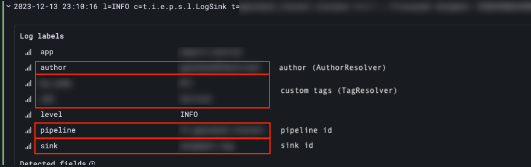
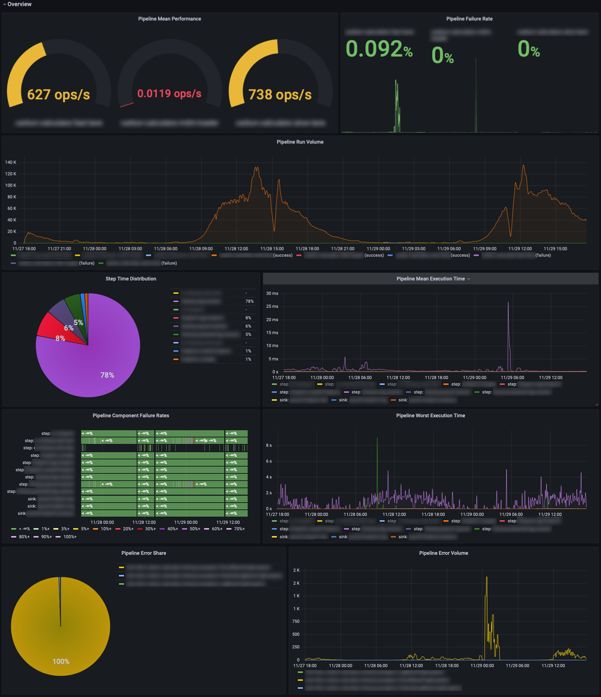

# Integrations

## Micrometer

`data-pipeline` automatically manages a number of micrometer meters in order to give insights into the performance and reliability of a pipeline and its components.

In order to enable activity tracking through micrometer, pass a `io.micrometer.core.instrument.MeterRegistry` to the pipeline builder:

```java
var pipeline = Pipeline.of("my-pipeline")
    // register steps, sinks, etc.
    .setMeterRegistry(meterRegistry)
    //.build()
;
```

In order to enable [a custom `TagResolver`](modifiers_and_hooks.md#tag-resolvers) for additional tags, pass it to the pipeline builder:

```java
var pipeline = Pipeline.of("my-pipeline")
    // register steps, sinks, etc.
    .setTagResolver(myTagResolver)
    //.build()
;
```

Here is a list of meters managed out-of-the-box by `data-pipeline`.
Each of these have a number of predefined tags like the `pipeline` name, or a `result` type.

| scope          | meter                                     | type      | tags                             | description                                |
|----------------|-------------------------------------------|-----------|----------------------------------|--------------------------------------------|
| pipeline       | `pipeline.run`                            | `timer`   | `pipeline`                       | Pipeline execution timer                   |
| pipeline       | `pipeline.run.total`                      | `counter` | `pipeline`                       | Total count of pipeline runs               |
| pipeline       | `pipeline.run.success`                    | `counter` | `pipeline`                       | Total count of successful pipeline runs    |
| pipeline       | `pipeline.run.failure`                    | `counter` | `pipeline`                       | Total count of failed pipeline runs        |
| pipeline       | `pipeline.run.error.total`                | `counter` | `pipeline` `error`               | Total count of pipeline exceptions         |
| initialization | `pipeline.initialization.run`             | `timer`   | `pipeline` `initializer`         | Initializer execution timer                |
| initialization | `pipeline.initialization.run.total`       | `counter` | `pipeline` `initializer`         | Total count of initializer runs            |
| initialization | `pipeline.initialization.run.success`     | `counter` | `pipeline` `initializer`         | Total count of successful initializer runs |
| initialization | `pipeline.initialization.run.failure`     | `counter` | `pipeline` `initializer`         | Total count of failed initializer runs     |
| initialization | `pipeline.initialization.run.error.total` | `counter` | `pipeline` `initializer` `error` | Total count of initializer exceptions      |
| step           | `pipeline.step.run`                       | `timer`   | `pipeline` `step`                | Step execution timer                       |
| step           | `pipeline.step.run.total`                 | `counter` | `pipeline` `step`                | Total count of step runs                   |
| step           | `pipeline.step.run.success`               | `counter` | `pipeline` `step`                | Total count of successful step runs        |
| step           | `pipeline.step.run.failure`               | `counter` | `pipeline` `step`                | Total count of failed step runs            |
| step           | `pipeline.step.run.result.total`          | `counter` | `pipeline` `step` `result`       | Total count of step results                |
| step           | `pipeline.step.run.error.total`           | `counter` | `pipeline` `step` `error`        | Total count of step exceptions             |
| sink           | `pipeline.sink.run`                       | `timer`   | `pipeline` `sink`                | Sink execution timer                       |
| sink           | `pipeline.sink.run.total`                 | `counter` | `pipeline` `sink`                | Total count of sink runs                   |
| sink           | `pipeline.sink.run.success`               | `counter` | `pipeline` `sink`                | Total count of successful sink runs        |
| sink           | `pipeline.sink.run.failure`               | `counter` | `pipeline` `sink`                | Total count of failed sink runs            |
| sink           | `pipeline.sink.run.error.total`           | `counter` | `pipeline` `sink` `error`        | Total count of sink exceptions             |

## Prometheus

Given the micrometer integration above, existing meters are trivially converted to prometheus metrics:
* through `micrometer-registry-prometheus`: [Prometheus integration](https://micrometer.io/docs/registry/prometheus) ; note that there are many alternatives such as [OTLP, Influx, Graphite or Datadog](https://micrometer.io/docs)
* or in a spring-boot application for instance: [Production-ready Features - Prometheus](https://docs.spring.io/spring-boot/docs/current/reference/html/actuator.html#actuator.metrics.export.prometheus)

In which case, the following metrics should become available:

| metric                                      | micrometer meter                      | type      | tags                                | description                                        |
|---------------------------------------------|---------------------------------------|-----------|-------------------------------------|----------------------------------------------------|
| `pipeline_run_seconds_count`                | `pipeline.run`                        | `counter` | `pipeline`                          | Total count of pipeline runs (micrometer Timer)    |
| `pipeline_run_seconds_sum`                  | `pipeline.run`                        | `counter` | `pipeline`                          | Total seconds spent in pipeline runs               |
| `pipeline_run_seconds_max`                  | `pipeline.run`                        | `gauge`   | `pipeline`                          | Max. seconds spent in a pipeline run               |
| `pipeline_run_total`                        | `pipeline.run.total`                  | `counter` | `pipeline`                          | Total count of pipeline runs                       |
| `pipeline_run_success_total`                | `pipeline.run.success`                | `counter` | `pipeline`                          | Total count of successful pipeline runs            |
| `pipeline_run_failure_total`                | `pipeline.run.failure`                | `counter` | `pipeline`                          | Total count of failed pipeline runs                |
| `pipeline_run_error_total`                  | `pipeline.run.error`                  | `counter` | `pipeline` `error`                  | Total count of pipeline exceptions                 |
| `pipeline_initialization_run_seconds_count` | `pipeline.initialization.run`         | `counter` | `pipeline` `initialization`         | Total count of initializer runs (micrometer Timer) |
| `pipeline_initialization_run_seconds_sum`   | `pipeline.initialization.run`         | `counter` | `pipeline` `initialization`         | Total seconds spent in initializer runs            |
| `pipeline_initialization_run_seconds_max`   | `pipeline.initialization.run`         | `gauge`   | `pipeline` `initialization`         | Max. seconds spent in an initializer run           |
| `pipeline_initialization_run_total`         | `pipeline.initialization.run.total`   | `counter` | `pipeline` `initialization`         | Total count of initializer runs                    |
| `pipeline_initialization_run_success_total` | `pipeline.initialization.run.success` | `counter` | `pipeline` `initialization`         | Total count of initializer pipeline runs           |
| `pipeline_initialization_run_failure_total` | `pipeline.initialization.run.failure` | `counter` | `pipeline` `initialization`         | Total count of failed initializer runs             |
| `pipeline_initialization_run_error_total`   | `pipeline.initialization.run.error`   | `counter` | `pipeline` `initialization` `error` | Total count of initializer exceptions              |
| `pipeline_step_run_seconds_count`           | `pipeline.step.run`                   | `counter` | `pipeline` `step`                   | Total count of step runs (micrometer Timer)        |
| `pipeline_step_run_seconds_sum`             | `pipeline.step.run`                   | `counter` | `pipeline` `step`                   | Total seconds spent in step runs                   |
| `pipeline_step_run_seconds_max`             | `pipeline.step.run`                   | `gauge`   | `pipeline` `step`                   | Max. seconds spent in an step run                  |
| `pipeline_step_run_total`                   | `pipeline.step.run.total`             | `counter` | `pipeline` `step`                   | Total count of step runs                           |
| `pipeline_step_run_success_total`           | `pipeline.step.run.success`           | `counter` | `pipeline` `step`                   | Total count of step pipeline runs                  |
| `pipeline_step_run_failure_total`           | `pipeline.step.run.failure`           | `counter` | `pipeline` `step`                   | Total count of failed step runs                    |
| `pipeline_step_run_result_total`            | `pipeline.step.run.result`            | `counter` | `pipeline` `step` `result`          | Total count of step results                        |
| `pipeline_step_run_error_total`             | `pipeline.step.run.error`             | `counter` | `pipeline` `step` `error`           | Total count of step exceptions                     |
| `pipeline_sink_run_seconds_count`           | `pipeline.sink.run`                   | `counter` | `pipeline` `sink`                   | Total count of sink runs (micrometer Timer)        |
| `pipeline_sink_run_seconds_sum`             | `pipeline.sink.run`                   | `counter` | `pipeline` `sink`                   | Total seconds spent in sink runs                   |
| `pipeline_sink_run_seconds_max`             | `pipeline.sink.run`                   | `gauge`   | `pipeline` `sink`                   | Max. seconds spent in an sink run                  |
| `pipeline_sink_run_total`                   | `pipeline.sink.run.total`             | `counter` | `pipeline` `sink`                   | Total count of sink runs                           |
| `pipeline_sink_run_success_total`           | `pipeline.sink.run.success`           | `counter` | `pipeline` `sink`                   | Total count of sink pipeline runs                  |
| `pipeline_sink_run_failure_total`           | `pipeline.sink.run.failure`           | `counter` | `pipeline` `sink`                   | Total count of failed sink runs                    |
| `pipeline_sink_run_error_total`             | `pipeline.sink.run.error`             | `counter` | `pipeline` `sink` `error`           | Total count of sink exceptions                     |

## Logback Loki

As it currently stands, `data-pipeline` comes with a logback-loki dependency.

If you don't use [logback](https://logback.qos.ch) nor [Loki](https://grafana.com/oss/loki/) at all this should be transparent, but if you do a simple tweak in your `logback.xml` enables log marker processing:

```xml
<configuration>
    <appender name="LOKI" class="com.github.loki4j.logback.Loki4jAppender">
        <http>
            <url>${LOKI_HOST}${LOKI_ENDPOINT}</url>
        </http>
        <format>
            <label>
                <pattern>app=my-app,job=pipeline,level=%level</pattern>
                <readMarkers>true</readMarkers> <!-- this is the relevant part -->
            </label>
            <!-- ...along with the rest of your configuration -->
        </format>
    </appender>
    <!-- ...along with the rest of your configuration -->
</configuration>
```

As a result, this is the kind of label that you will get on marked logs:



## Grafana

With standardized prometheus metrics available, offering a grafana dashboard template becomes accessible.

Here is an example of one such dashboard in action:



## Resilience4j

`data-pipeline` comes with several implementations of [component wrappers](modifiers_and_hooks.md#wrappers), they enable typical resilience use-cases such as retrying a component in case of error, or limiting the time spent in a component. 

### CircuitBreaker

The CircuitBreaker wrapper can be applied on `Step` or `Sink` functions, and enables circuit-breaking capabilities for the component.
The implementation leverages the [circuit-breaker `resilience4j` component](https://resilience4j.readme.io/docs/circuitbreaker), see their documentation for more information on use-cases and configuration.


A circuit-breaker can be added on a `StepAssembler` with its `withWrapper` function, it is configured using the resilience4j `CircuitBreakerConfig` class:

```java
var config = CircuitBreakerConfig.custom()
    .failureRateThreshold(50)
    .slowCallRateThreshold(50)
    .waitDurationInOpenState(Duration.of(1, SECONDS))
    .slowCallDurationThreshold(Duration.of(2, SECONDS))
    .build()
;

var pipeline = Pipeline.of("my-pipeline")
    .registerStep(builder -> builder
        .step(new MyStep())
        .withWrapper(new CircuitBreakerWrapper<>(config))
    )
    //.build()
;
```

### Retry

The Retry wrapper can be applied on `Step` or `Sink` functions, and enables retry capabilities for the component.
The implementation leverages the [retry `resilience4j` component](https://resilience4j.readme.io/docs/retry), see their documentation for more information on use-cases and configuration.

A retry can be added on a `StepAssembler` with its `withWrapper` function, it is configured using the resilience4j `RetryConfig` class:

```java
var config = RetryConfig.custom()
    .maxAttempts(2)
    .waitDuration(Duration.of(100, MILLISECONDS))
    .build()
;

var pipeline = Pipeline.of("my-pipeline")
    .registerStep(builder -> builder
        .step(new MyStep())
        .withWrapper(new RetryWrapper<>(config))
    )
    .build()
;
```

### TimeLimiter

The TimeLimiter wrapper can be applied on `Step` or `Sink` functions, and enables timeout capabilities for the component.
The implementation leverages the [time-limiter `resilience4j` component](https://resilience4j.readme.io/docs/timeout), see their documentation for more information on use-cases and configuration.

A timeout can be added on a `StepAssembler` with its `withWrapper` function, it is configured using the resilience4j `TimeLimiterConfig` class:

```java
var config = TimeLimiterConfig.custom()
    .cancelRunningFuture(true)
    .timeoutDuration(Duration.of(500, MILLISECONDS))
    .build()
;

var pipeline = Pipeline.of("my-pipeline")
    .registerStep(builder -> builder
        .step(new MyStep())
        .withWrapper(new TimeLimiterWrapper<>(config))
    )
    //.build()
;
```
