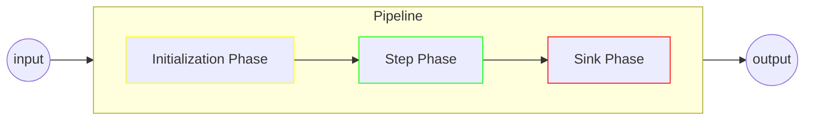

# Pipelines

The core idea of pipelines is that they should act as a stateless pipe which behaviour is almost entirely determined through composition.
They accept an external input, each `Step` may produce a `Result`, and either it ends in one or several `Sink` or the caller can recover the pipeline's `Output`, which aggregates all produced step results.

The pipeline's input is considered immutable and the only expected state manipulations are the `Step` outputs.

## Configuration

A `Pipeline` is expected to be built through pipeline builders, which are created through the `Pipeline.of` family of methods.

First, we get a builder from one of the `of` methods:

```java
// A call to Pipeline.of(String) with type hinting is the most common scenario
// The type corresponds to the expected input type, the String argument is the pipeline name that will be tracked in tags, metrics and logs  
var builder = Pipeline.<String>of("my-pipeline");
```

From there, we could make a basic pipeline out of lambdas, we register all the components needed:

```java
var pipeline = Pipeline.<String>of("my-pipeline")
    .registerStep((in, results, ctx) -> new MyResult("Let's do this: " + in))
    .registerStep((in, results, ctx) -> new MyResult("On second thought, maybe not"))
    .registerSink((output, ctx) -> output.results().stream(MyResult.class).forEach(System.out::println))
    .build()
;
```

The pipeline builder is the place where you can specify which component to use:
* an `Initializer` when applicable, coupled with one or more `Indexer` functions (more details [in the Initializer section](initializers.md))
* zero or more `Step` functions (more details [in the Steps section](steps.md))
* zero or more `Sink` functions (more details [in the Sinks section](sinks.md))

...but also global behaviours (as in, scoped to the pipeline as a whole, either) such as:
* the pipeline's identifier
* the [UID generation strategy](modifiers_and_hooks.md#uid-generators)
* the [author resolver](modifiers_and_hooks.md#author-resolvers)
* the [tag resolver](modifiers_and_hooks.md#tag-resolvers)
* the `ServiceExecutor` supplier for running [parallel asynchronous sinks](sinks.md#parallel-asynchronous-sinks)
* the `MeterRegistry` to be used for the [micrometer integration](integrations.md#micrometer) (and by extension, [prometheus](integrations.md#prometheus))
* the default [`ResultEvaluator` strategy](steps.md#result-evaluators)
* the default [`StepErrorHandler` strategy](steps.md#error-handlers)
* the default [`SinkErrorHandler` strategy](sinks.md#error-handlers)
* the `OutputFactory` to be used [for producing the pipeline's `Output`](#output)
* zero or more `OnCloseHandler` functions (see ["Shutting down"](#shutting-down))
* the pipeline close timeout duration (see ["Shutting down"](#shutting-down))

## Execution

From the outside, pipelines can accept a single `input` and produce a structured `Output` object aggregating `Step` results and other metadata. 

From the inside, pipeline executions are organized in sequentially executed phases, there are three phases:
* the `Initialization Phase` documented in the [initializers section](initializers.md)
* the `Step Phase` documented in the [steps section](steps.md)
* the `Sink Phase` documented in the [sinks sections](sinks.md)



> 💡 At the time of this writing the implementation of the `Initialization Phase` is a bit of an outlier due to its setup role, but the other two share common properties through their `PipelinePhase` contract:
> * when they exit, they are expected to return a `PipelineStrategy` (`CONTINUE` or `EXIT`) which is used by the pipeline to determine whether to go onto the next phase or not
> * upon [closing down a `Pipeline`](#shutting-down), it will call on all its phases' `close()` methods, allowing the wrap-up of resources such as a `ServiceExecutor`

> 🔮 Although the current setup of `StepPhase` and `SinkPhase` are currently hardwired, `CompositePipeline` are structured in such a way that custom `PipelinePhase` are perfectly possible, this could come in a future update.

### Input

The input is the pipeline's main inbound interface with the outside world, they can be any Java type of your choosing.

From a design standpoint, inputs are considered immutable. While there is nothing to prevent you from altering the input as you go, the idiomatic way to design pipelines is to consider the input as immutable and use step function `Result` as a mean for producing information.  

```java
pipeline.run("some string");
```

Calling a `Pipeline` without input is equivalent to a `null` input, which is a perfectly valid pattern when only working with successions of `Step` and their results.  

```java
pipeline.run();
```

### Context

The Pipeline `Context` is a structure for holding:
* custom metadata that can influence the pipeline's behaviour (header data from a kafka payload, feature flags, etc.)
* an optional reference to a previous pipeline run's `Output`, enabling [pipeline inheritance](result_data_model.md#pipeline-inheritance-and-result-continuity)  

By default, the pipeline will create an empty `Context` instance that you can enrich with your metadata upon calling on the pipeline:

```java
pipeline.run("some string", ctx -> ctx.set("my_key", "abcde"));
```

...and then, in a step function, you can ask for the `Context` to be passed as an argument:

```java
@StepConfig
public MyResult doStuff(Context<?> ctx)
{
    // Context getters return optionals, here myValue should contain "abcde"
    Optional<String> myValue = ctx.get("my_key", String.class);
}
```

Inheriting from a previous pipeline is done by initializing the `Context` with the previous pipeline's output.
Pipeline inheritance is covered in more details in the ["Result Data Model documentation"](result_data_model.md#pipeline-inheritance-and-result-continuity)

```java
//Output<?> output;
pipeline.run("some string", new SimpleContext<>(output));
```

`Context` is an interface, and you can create alternate implementations if needed.
If you do that, you can instantiate your context and pass it directly as an argument:

```java
pipeline.run("some string", new MySpecialContext<>().set("my_key", "abcde"));
```

### Output

The `Output` is the final byproduct of a `Pipeline`, most use-cases for `data-pipeline` do not involve using the output at all, most typically the pipeline would simply end in one or several sinks, but if you need to use a pipeline as a function, this is how.  

The `Output` object aggregates:
* all produced step results 
* the context that was produced for the run
* the payload that was produced for the run (see the [Initializers documentation](initializers.md) for more details on payloads)

```java
var pipeline = Pipeline.<String>of("my-pipeline")
    .registerStep((in, results, ctx) -> new MyResult("Let's do this: " + in))
    .registerStep((in, results, ctx) -> new MyResult("On second thought, maybe not"))
    .build()
;

var out = pipeline.run("my input");

// Results getters return optionals
// the result below should contain the string "On second thought, maybe not"
Optional<MyResult> result = out.results().latest(MyResult.class);

// result at results.get(0) below should contain the string "Let's do this: my input"
// result at results.get(1) below should be the same as above
List<MyResult> results = out.results().stream(MyResult.class).toList();
```

The actual implementation of `Output` can be customized by changing the pipeline's `OutputFactory`.

A custom factory looks something like this:

```java
public class MyFactory<I, P> implements OutputFactory<I, P>
{
    @Override
    public Output<P> create(PipelineTag tag, I input, P payload, Context<P> context)
    {
        return new MyCustomOutput<>(tag, payload, context);
    }
}
```

Then, on the pipeline builder:

```java
var pipeline = Pipeline.<String>of("my-pipeline")
    //register steps, etc.
    .setOutputFactory(myFactory)
    .build()
;
```

## Shutting Down

Pipelines may leverage resources that need to be properly cleaned-up when the `Pipeline` is no longer in use.
They implement `AutoCloseable` and as such can be used in `try-with` patterns or their `close()` method manually called.

When closing a `Pipeline`, it will internally delegate to its phase implementations, and close them down as well.
For instance, the sink phase can leverage a `ServiceExecutor` for running parallel asynchronous sinks, the sink phase will close the executor.

You can configure the close timeout period from the pipeline builder:

```java
var pipeline = Pipeline.<String>of("my-pipeline")
    //register steps, etc.
    .setCloseTimeout(15) //in seconds
    .build()
;
```

If you need to perform custom cleanup logic, you can register one or more `OnCloseHandler`, they are ran in the same order they were registered, just before closing down `PipelinePhase` instances:

```java
var pipeline = Pipeline.<String>of("my-pipeline")
    //register steps, etc.
    .registerOnCloseHandler(() -> System.out.println("We're closing"))
    .registerOnCloseHandler(someExternalService::close)
    .build()
;
```
