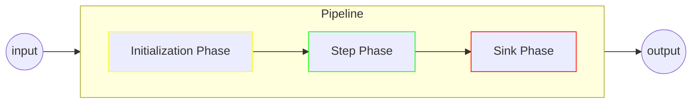

# Pipelines

The core idea of pipelines is that they should act as a stateless pipe which behaviour is almost entirely determined through composition.
They accept an external input, each `Step` may produce a `Result`, and either it ends in one or several `Sink` or the caller can recover the pipeline's `Output`, which aggregates all produced step results.

The pipeline's input is considered immutable and the only expected state manipulations are the `Step` outputs.

## Configuration

A `Pipeline` is expected to be built through pipeline builders, which are created through the `Pipeline.of` family of methods.

First, we get a builder from one of the `of` methods:

```java
// A call to Pipeline.of(String) with type hinting is the most common scenario
// The type corresponds to the expected input type, the String argument is the pipeline name that will be tracked in tags, metrics and logs  
var builder = Pipeline.<String>of("my-pipeline");
```

From there, we could make a basic pipeline out of lambdas, we register all the components needed:

```java
var pipeline = Pipeline.<String>of("my-pipeline")
    .registerStep((in, results, ctx) -> new MyResult("Let's do this: " + in))
    .registerStep((in, results, ctx) -> new MyResult("On second thought, maybe not"))
    .registerSink((output, ctx) -> output.results().stream(MyResult.class).forEach(System.out::println))
    .build()
;
```

The pipeline builder is the place where you can specify which component to use:
* an `Initializer` when applicable, coupled with one ore more `Indexer` functions (see the [related documentation](initializers.md))
* zero or more `Step` functions (more details [in the relevant section](steps.md))
* zero or more `Sink` functions (more details [in the relevant section](sinks.md))

...but also global behaviours (as in, scoped to the pipeline as a whole, either) such as:
* the pipeline's identifier
* the [UID generation strategy](modifiers_and_hooks.md#uid-generators)
* the [author resolver](modifiers_and_hooks.md#author-resolvers)
* the [tag resolver](modifiers_and_hooks.md#tag-resolvers)
* the `ServiceExecutor` supplier for running parallel asynchronous sinks (see the [related documentation](sinks.md#parallel-asynchronous-sinks))
* the `MeterRegistry` to be used for the [micrometer integration](integrations.md#micrometer) (and by extension, [prometheus](integrations.md#prometheus))
* the default `ResultEvaluator` strategy
* the default `StepErrorHandler` strategy
* the default `SinkErrorHandler` strategy
* zero or more `OnCloseHandler` functions (see ["Shutting down"](#shutting-down))
* the pipeline close timeout duration (see ["Shutting down"](#shutting-down))

## Execution

From the outside, pipelines can accept a single `input` and produce a structured `Output` object aggregating `Step` results and other metadata. 

From the inside, pipeline executions are organized in sequentially executed phases, there are three phases:
* the `Initialization Phase` documented in the [initializers section](initializers.md)
* the `Step Phase` documented in the [steps section](steps.md)
* the `Sink Phase` documented in the [sinks sections](sinks.md)



At the time of this writing the implementation of the `Initialization Phase` is a bit of an outlier due to its setup role, but the other two share common properties through their `PipelinePhase` contract:
* when they exit, they are expected to return a `PipelineStrategy` (`CONTINUE` or `EXIT`) which is used by the pipeline to determine whether to go onto the next phase or not
* upon [closing down a `Pipeline`](#shutting-down), it will call on all its phases' `close()` methods, allowing the wrap-up of resources such as a `ServiceExecutor`

Although the current setup of `StepPhase` and `SinkPhase` are currently hardwired, `CompositePipeline` are structured in such a way that custom `PipelinePhase` are perfectly possible, this should come in a future update.

### Input

Immutable

Input typing

Null inputs

### Context

Context for metadata arguments

Context for pipeline inheritance

### Output

Output structure

Output Factory

## Shutting Down

close timeout

OnCloseHandler

## Pipeline Container
