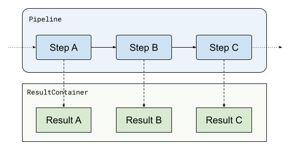
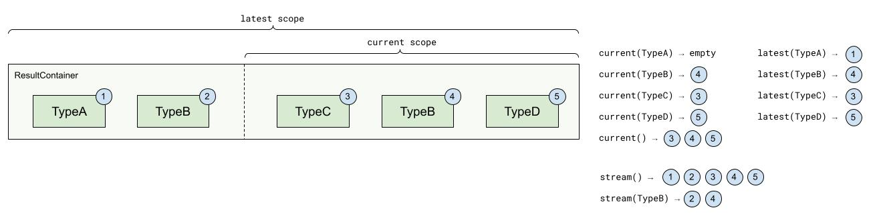
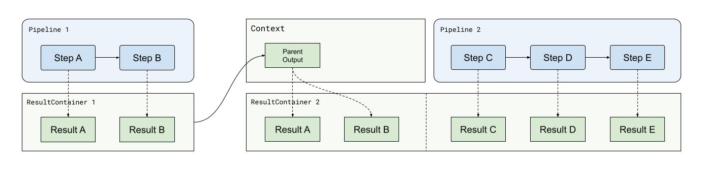

# Result Data Model

In this section, we will explain how return values from [steps](steps.md) are organized and the different ways you can access them in a pipeline.

The core principle to keep in mind is that in `data-pipeline`, there are three ways data is expected to flow:
* inbound from the outside: the pipeline's input, considered immutable
* within the pipeline: step results, considered immutable 
* outbound from the pipeline: sinks with side effects, or eventually via the `Output` container

Each step in a pipeline produces a `Result` which is pushed and tracked into a structure called the `ResultContainer`:



Afterward, every next component along the way will have access to previously pushed results.
For instance, if we were to write the `Step C` from above, we could ask for `Result A` and `Result B` to be passed as arguments:

```java
public class StepC
{
    //where A, B and C are Results
    @StepConfig
    public C doStuff(@Current A resultA, @Current B resultB) {}
}
```

Or in a `Sink`, you would have access to all produced results ([assuming all steps were executed and no result was discarded](steps.md#result-evaluators)):

```java
public class MySink
{
    //where A, B and C are Results
    @SinkConfig
    public void doStuff(@Current A resultA, @Current B resultB, @Current C resultC) {}
}
```

## Tags and Lineage

`data-pipeline` puts an emphasis on the ability to track the provenance or lineage of its execution and data it produces.
For that purpose, it will generate "tags" along the way, and apply those to runs, results, and observability byproducts, making it possible to uniquely identify them.

As it stands there are two types of tags: `PipelineTag` and `ComponentTag`.

### `PipelineTag`

The `PipelineTag` is generated at the start of a pipeline run, containing:
* a pipeline `name` (as determined by the Pipeline's `id`)
* a run unique `uid` (as [determined by the `UidGenerator`](modifiers_and_hooks.md#uid-generators))
* a run `author` (as [determined by the `AuthorResolver`](modifiers_and_hooks.md#author-resolvers))

A typical `PipelineTag` may look like this:

```json
{
  "name": "my-pipeline",
  "uid": "2axhxfxn4x0agygvfqdevgc69ru",
  "author": "some_user@myapp.com"
}
```

They can be injected in `Initializer`, `Step` and `Sink` functions by type as described in their respective documentation.

### `ComponentTag`

The `ComponentTag` is generated at the start of each component run (step, sink, etc.), containing:
* a component `id` (as determined by the component's `id`)
* a component `family` depending on the type of component (`INITIALIZER`, `STEP` or `SINK`)
* a run unique `uid` (as [determined by the `UIDGenerator`](modifiers_and_hooks.md#uid-generators))
* a run `pipelineTag` reference to current pipeline's `PipelineTag`

A typical `ComponentTag` may look like this:

```json
{
  "id": "my-step",
  "family": "STEP",
  "uid": "2axhxgjnoznxdpvzvas3vnrqh1q",
  "pipelineTag": {
    "name": "my-pipeline",
    "uid": "2axhxfxn4x0agygvfqdevgc69ru",
    "author": "some_user@myapp.com"
  }
}
```

They can be injected in `Initializer`, `Step` and `Sink` functions by type as described in their respective documentation.

## Result Container

The `ResultContainer` is responsible for holding references to all results produced during a `Pipeline` run.

They come with a variety of methods for accessing results, allowing for different strategies:
* results can be identified by their java type (most common use-case)
* results can be identified by a user-defined name (for discriminating generic result types)
* results can be considered `Optional` if a step execution is optional or if it returns results of varying identifiers
* results can be considered a `Stream` if several steps produce results with the same identifier
* results have a scope: `current` and `latest`
  * `current` covers the current execution scope, i.e. only what steps produced since the pipeline started
  * `latest` covers both the current execution scope and results supplied via [pipeline inheritance](#pipeline-inheritance-and-result-continuity)



Examples can be found in the documentation:
* for steps: [type-binding](steps.md#by-type) and [name-binding](steps.md#by-name), each with [@Current](steps.md#current) and [@Latest](steps.md#latest) variants, `Optional` and `Stream` variants
* for sinks: [type-binding](sinks.md#by-type) and [name-binding](sinks.md#by-name), each with [@Current](sinks.md#current) and [@Latest](sinks.md#latest) variants, `Optional` and `Stream` variants

## Pipeline Inheritance and Result Continuity

One of the core aspects of this data model is that results can be stacked in order to enable state continuity between pipelines.

When a pipeline is executed with a `Context` initialized from a previous output, the pipeline's result container will be able to access previous results in the `latest` scope:



Setting it up is done the following way:

```java
var firstOutput = firstPipeline.run("some-input");

otherPipeline.run("other-input", new SimpleContext<>(firstOutput));
```
